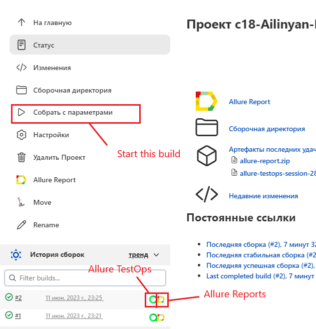
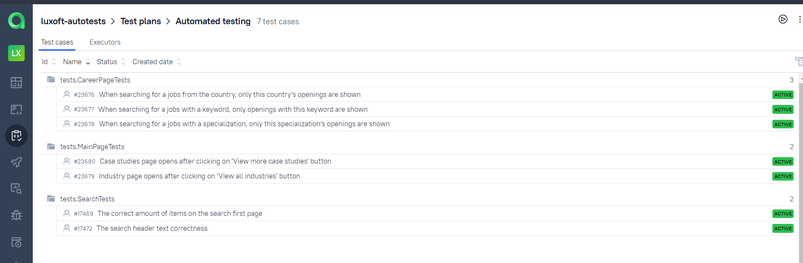
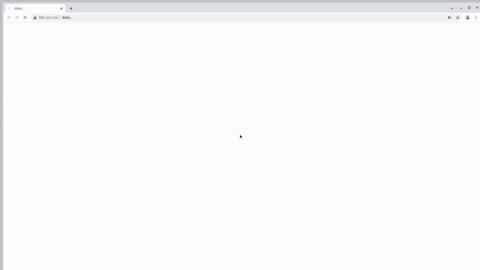

# Automated test set for Luxoft official website


## :page_with_curl:	Contents
+ [Test cases run](#test-cases-run)
+ [Instruments used](#instruments-used)
+ [How to run these tests](#how-to-run-these-tests)
    + [Using console](#using-the-console)
    + [Using Jenkins](#using-jenkins)
+ [Final report in Allure Reports](#final-report-in-allure-reports)
+ [Allure TestOps integration](#allure-testops-integration)
+ [Test results](#test-results)
<!-- + [Интеграция с Jira](#Jira) -->

## Test cases run
### Automated test cases
- Main page
  - [x] The main page logo visibility
  - [x] The correct amount of services listed in the OUR SERVICES section
  - [x] The correct amount of social media links in the footer
- Search page
  - [x] The search results start from the first page
  - [x] The search header text correctness
  - [x] The correct amount of items on the search first page
### Manual test cases
- Main page
  - [x] The header navigation has clickable links
  - [x] The header navigation hovering initiates a dropdown menu
- Search page
  - [x] No items shown for a search with random symbols
  - [x] The search header says there are no results for a search with random symbols


# Instruments used
<p  align="center">
  <code></code>
  <code></code>
  <code></code>
  <code></code>
  <code></code>
  <code></code>
  <code></code>
  <code></code>
  <code></code>
  <code></code>
<!--   <code></code> -->
  <code></code>

</p>

+ **Java** is the primary programming language for this project.
+ **Selenide** framework was used for writing the automated tests.
+ **JUnit 5** is used as a unit testing framework.
+ **Gradle** is used to build the project.
+ **Jenkins** is used to run the tests.
+ **Selenoid** is used to launch browsers in **Docker** containers.
+ **Allure Report** is used to visualize test results.
+ **Telegram API** is used for receiving the final report via Telegram Bot.


# <a name="HowToRun">How to run these tests</a>
Please note that the following methods will run the tests with the following parameters:
+ Browser: **Google Chrome**
+ Browser version: **100.0**
+ Browser size: **1920x1080**

### <a name="Console">Using the console</a>
To run the automated tests:
```bash
gradle clean test 
```
To get the report:
```bash
allure serve build/allure-results
```

### <a name="Jenkins">Using [Jenkins](https://jenkins.autotests.cloud/job/c18-Ailinyan-MiniProject15/)</a>

To run this test through Jenkins, please use this [job](https://jenkins.autotests.cloud/job/c18-Ailinyan-MiniProject15/), specially created for this project.
The environment is set up for Russian language, to run it please use the button with an :arrow_forward:.
You can see the results via Allure Reports, or use the link to Allure TestOps.

<p  align="center">

</p>


# <a name="AllureReports">Final report in [Allure Reports](https://jenkins.autotests.cloud/job/c18-Ailinyan-MiniProject15/)</a>

#### Общая информация
The main page of the Allure report contains the following information blocks:

>- <code><strong>*ALLURE REPORT*</strong></code> - displays the following info for the given run:
>>- Date and time; 
>>- The total number of cases in the given run; 
>>- A pie chart indicating the percentage and number of test results: successful, failed, or broken.
>- <code><strong>*TREND*</strong></code> - a line chart that displays the trend of passing tests from build to build
>- <code><strong>*SUITES*</strong></code> - displays the distribution of test results across test suites
>- <code><strong>*CATEGORIES*</strong></code> - displays the distribution of failed tests sorted by defect types
<p align="center">
  
</p>

### List of tests with a description of steps and visualization of results
This page presents the standard distribution of the tests run by user stories and test suites.

<p align="center">
  
</p>


# <a name="AllureTestOps">[Allure TestOps](https://allure.autotests.cloud/project/2195/) integration</a>

### The main dashboard
<p align="center">
  
</p>

### Project's test plans
<p align="center">
  
</p>

#### Manual test cases
<p align="center">
  
</p>

#### Automated test cases
<p align="center">
  
</p>

### All test cases
<p align="center">
  
</p>

### Launches
<p align="center">
  
</p>

### Launch details
<p align="center">
  
</p>

### Defects
<p align="center">
  
</p>


# [Jira](https://jira.autotests.cloud/) integration

### Ticket linked with Allure TestOps defect
<p align="center">
  
</p>

###  Main page content layout Jira task
<p align="center">
  
</p>

###  Search from the main page Jira task
<p align="center">
  
</p>


# <a name="Results">Test results</a>

### Selenoid sample run demo
There's a video attachment for each test available.
<p align="center">
  
</p>

### Telegram notification example
<p align="center">

</p>