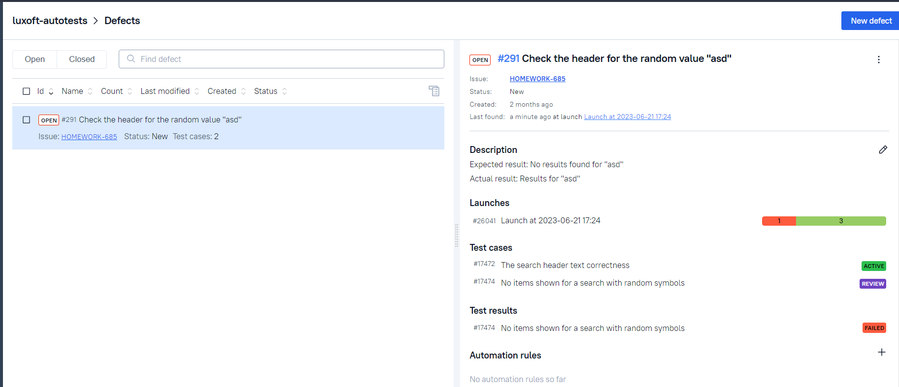
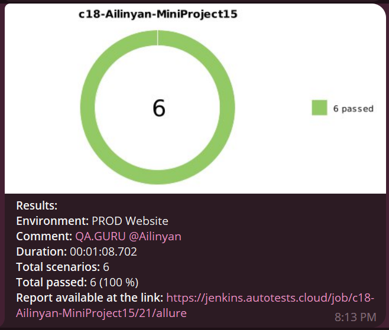

# Automated test set for Luxoft official website


## Contents
+ [Introduction](#Description)
+ [Instruments](#Technology)
+ [How to run the test with Jenkins](#HowToRun)
    + [Using console](#Console)
    + [Using Jenkins](#Jenkins)
+ [Final report in Allure Reports](#AllureReports)
+ [Allure TestOps integration](#AllureTestOps)
+ [Test reslts](#Results)
<!-- + [Интеграция с Jira](#Jira) -->

## <a name="Description">Test cases run</a>
### Automated test cases
- [x] 
### Manual test cases
- [x] 


# <a name="Technology">Instruments used</a>
<p  align="center">
  <code></code>
  <code></code>
  <code></code>
  <code></code>
  <code></code>
  <code></code>
  <code></code>
  <code></code>
  <code></code>
  <code></code>
<!--   <code></code> -->
  <code></code>

</p>

+ **Java** is the primary programming language for this project.
+ **Selenide** framework was used for writing the automated tests.
+ **JUnit 5** is used as a unit testing framework.
+ **Gradle** is used to build the project.
+ **Jenkins** is used to run the tests.
+ **Selenoid** is used to launch browsers in **Docker** containers.
+ **Allure Report** is used to visualize test results.
+ **Telegram API** is used for receiving the final report via Telegram Bot.


# <a name="HowToRun">How to run these tests</a>
Please note that the following methods will run the tests with the following parameters:
+ Browser: **Google Chrome**
+ Browser version: **100.0**
+ Browser size: **1920x1080**

### <a name="Console">Using the console</a>
To run the automated tests:
```bash
gradle clean test 
```
To get the report:
```bash
allure serve build/allure-results
```

### <a name="Jenkins">Using [Jenkins](https://jenkins.autotests.cloud/job/c18-Ailinyan-MiniProject15/)</a>

To run this test through Jenkins, please use this [job](https://jenkins.autotests.cloud/job/c18-Ailinyan-MiniProject15/), specially created for this project.
The environment is set up for Russian language, to run it please use the button on the screenshot below.

<p  align="center">

</p>


# <a name="AllureReports">Final report in [Allure Reports](https://jenkins.autotests.cloud/job/c18-Ailinyan-MiniProject15/)</a>

#### Общая информация
The main page of the Allure report contains the following information blocks:

>- <code><strong>*ALLURE REPORT*</strong></code> - displays the following info for the given run:
>>- Date and time; 
>>- The total number of cases in the given run; 
>>- A pie chart indicating the percentage and number of test results: successful, failed, or broken.
>- <code><strong>*TREND*</strong></code> - a line chart that displays the trend of passing tests from build to build
>- <code><strong>*SUITES*</strong></code> - displays the distribution of test results across test suites
>- <code><strong>*CATEGORIES*</strong></code> - displays the distribution of failed tests sorted by defect types
<p align="center">
  
</p>

### List of tests with a description of steps and visualization of results
This page presents the standard distribution of the tests run by user stories, test suites, and Java classes from the code.

<p align="center">
  
</p>


# <a name="AllureTestOps">[Allure TestOps](https://allure.autotests.cloud/project/2195/) integration</a>

### The main dashboard
<p align="center">
  
</p>

### The dashboard for different test types
<p align="center">
  
</p>

### Launches
<p align="center">
  
</p>

### Launch details
<p align="center">
  
</p>

### Test cases
<p align="center">
  
</p>

### Defects
<p align="center">
  
</p>


<!-- # <a name="Jira">[Jira](https://jira.autotests.cloud/) integration</a> -->


# <a name="Results">Test results</a>

### Selenoid sample run demo
<p align="center">
    
<!--     <video src='images/videoMob.mp4' width=450/> -->
</p>

### Telegram notification example
<p align="center">

</p>